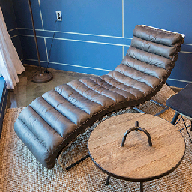
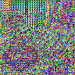

# Verilog Fast Image Scaling

Fast Image Scaling using Verilog HDL

serial 통신을 통해 받아들인 이미지 데이터를 원하는 사이즈로 down scaling한다.

## Results

### Original Image

### Downscaling to 192

### Downscaling to 128

### Downscaling to 96

### Downscaling to 64

